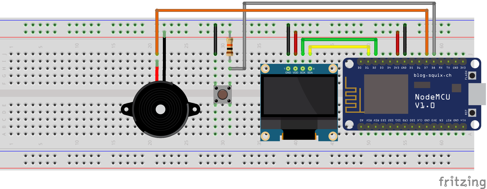

# PastillaRemember

A little iot app to remeber take the pill

## But why?

Because I always forget! and it's a fun weekend project.

## Instalation

On the RPI you need Python3 and Node-Red and install this library:

### Paho for MQTT
`pip install paho-mqtt`

### Node-Red
Import the flow.json file that is in the flow folder. You can modify the function to show the weather from your area.

### Keys

> Remember replace with your own api key on the flow and the config.json file, also replace with your WiFi credentials and mqtt server.

### Board
In the dk-8266 is the program to run on the board. 

This is the schematics to build the circuit:

